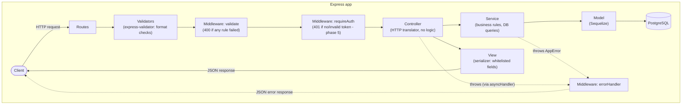

# Architecture

## Request flow

Every request travels through the same pipeline. Each layer has one job and
only talks to its neighbors:



## Error format

Every error response, without exception:

```json
{ "error": "Human readable message" }
```

Produced in exactly two places: the `validate` middleware (400) and the
global `errorHandler` (everything else, including `AppError` thrown by
services and 404s for unknown routes).

## Design decisions

| Decision | Choice | Why |
| --- | --- | --- |
| Module system | ES Modules (`"type": "module"`) | Modern standard; top-level `await`; required by current tooling. Relative imports carry the `.js` extension (`./env.js`) because Node ESM resolves real file paths. |
| Strict TypeScript | `strict` + `noUnusedLocals` + `noImplicitReturns` | Catch bugs at compile time; no `any` allowed in the codebase. |
| ORM | Sequelize v6 | Mature, TypeScript-friendly, migrations available later (phase 10). |
| IDs | `BIGINT` (`BIGSERIAL`) | Matches the original SQL design. `config/db.ts` registers a `pg` type parser so int8 arrives as `number`, not `string`. |
| Soft delete | `paranoid: true` globally | Rows are never physically removed (`deleted_at`), matching the SQL design and keeping loyalty/referral history intact. |
| Column names | `underscored: true` globally | camelCase in TypeScript, snake_case in PostgreSQL, zero per-model config. |
| Schema management | `sequelize.sync()` in development only | Zero-friction local setup. Production will use versioned migrations (phase 10); `sync` is disabled outside development. |
| Express version | 4.x (with `asyncHandler`) | Largest middleware ecosystem; `asyncHandler` makes async error flow explicit for learners. Express 5 catches async errors natively — migrating later is trivial. |
| Validation | `express-validator` chains per route | Format checks at the edge (400), business rules in services (409/404/...). Clear separation of concerns. |
| Error handling | `AppError` factories + global middleware | One uniform error shape, status codes chosen once (`AppError.conflict` = 409), impossible to leak stack traces. |
| Serialization | Dedicated `views/` layer | Fields are whitelisted one by one; `passwordHash` can never leak by accident (no `JSON.stringify` of models, ever). |
| File uploads (phase 7) | Local `uploads/` + sharp (WebP) | User requirement: self-hosted storage with WebP conversion instead of Cloudinary. |
| Docker | `docker-compose.yml` with Postgres 16.2 | Reuses the image already present on the dev machine; port 5440 avoids collisions with other local containers. |

## Folder map

```
src/
├── index.ts        # Entry point: connect DB -> (dev) sync -> listen
├── server.ts       # Express app assembly: middlewares, routes, error handlers
├── config/         # Validated env vars + Sequelize instance
├── types/          # Shared domain types (roles, statuses) + Request augmentations
├── models/         # Sequelize models + associations + syncModels()
├── views/          # Serializers: whitelisted response fields
├── services/       # Business logic (no Express)
├── controllers/    # HTTP translators (no queries, no logic)
├── middlewares/    # validate, error handlers, (auth in phase 5)
├── validators/     # express-validator chains per resource
├── routes/         # URL definitions + apiRouter
└── utils/          # AppError, asyncHandler, hash, jwt
```
